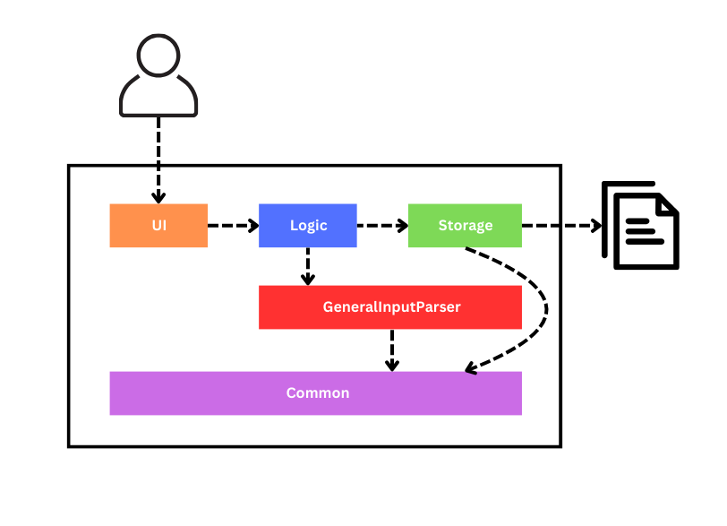

# Mihir Heda's Project Portfolio Page

## Project: Brokeculator

### Overview
Brokeculator is a CLI application designed for university students to log and view their
expenses. It aims to tackle the challenge they face of managing a myriad of expenses across various categories. For
experienced CLI users, they can enter their expenses faster compared to GUI applications

### Summary of Contributions

#### Code contributed: [RepoSense link](https://nus-cs2113-ay2324s2.github.io/tp-dashboard/?search=mihirheda02&breakdown=true&sort=groupTitle%20dsc&sortWithin=title&since=2024-02-23&timeframe=commit&mergegroup=&groupSelect=groupByRepos&checkedFileTypes=docs~functional-code~test-code~other)

#### Features implemented
- Implemented the `Expense` class which is used to store the details of an expense.
- Implemented the `ExpenseManager` class which is used to manage the expenses.

#### Enhancements implemented
- Implemented the `DateParser` class which is used to parse the date string entered by the user.
- Added summarise by date feature to the `SummariseParser` class.
- Implemented the `TerminalHandler` class which provides the user with extended features like command line history and editing the current line.

#### Contributions to User Guide
- Created the table of contents with working links.
- Refactored user guide examples to use the correct date format once the `DateParser` class was implemented.
- Added a features section to specify that users can use the `up` and `down` arrow keys to navigate through the command history, and the `left` and `right` arrow keys to navigate through the current line.

#### Contributions to Developer Guide
- Refactored the table of contents to follow a similar format as the template.
- Created an architecture diagram explaining the high-level flow of the CLI application.
- Added an implementation section to explain the `UI` and `TerminalHandler` classes, while further elaborating on the features they provide.
- Created the `Use Cases` section to explain the MSS (Main Success Scenario) and possible extensions of each command.

#### Contributions to team-based tasks
- Reviewed and provided feedback on PRs to ensure that the codebase adheres to the coding standards.
- Managed GitHub issues with the rest of the team.
- Linked PRs to issues and milestones.
- Updated UG and DG content unrelated to features.

#### Review/mentoring contributions
- Reviewed the following PRs: [#23](https://github.com/AY2324S2-CS2113-F14-1/tp/pull/23), [#34](https://github.com/AY2324S2-CS2113-F14-1/tp/pull/34), [#43](https://github.com/AY2324S2-CS2113-F14-1/tp/pull/43)

#### Contributions beyond the project team
- Created 7 bug reports during the PE dry run.

### Contributions to the Developer Guide (Extracts)

#### Architecture Diagram

#### Example use case
> **Use case: Add a category**
> 
> **MSS**
> 1. User requests to add a category.
> 2. Brokeculator adds the category and shows a confirmation message.
> 
> **Use case ends.**
>
> **Extensions**
> - 2a. The category already exists.
>   - 2a1. Brokeculator shows a category already exists message.
>   - **Use case ends.**
> - 2b. The input format is invalid.
>   - 2b1. Brokeculator shows an invalid format message.
>   - **Use case ends.**
